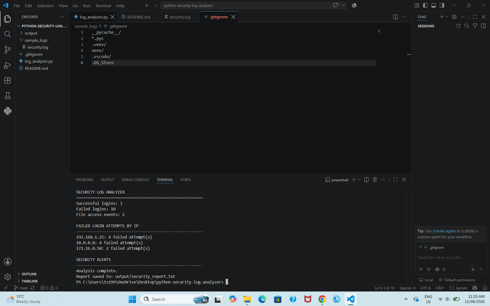

## Project Structure

```text
python-security-log-analyzer/
├── log_analyzer.py
├── README.md
├── sample_logs/
│   └── security.log
└── output/
    └── security_report.txt
```

## Demo

Below is an example of the Python Security Log Analyzer detecting suspicious failed-login activity and generating security alerts.


